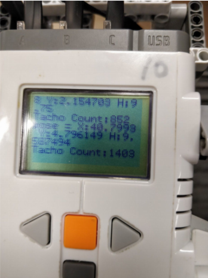
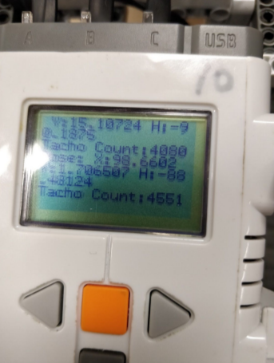
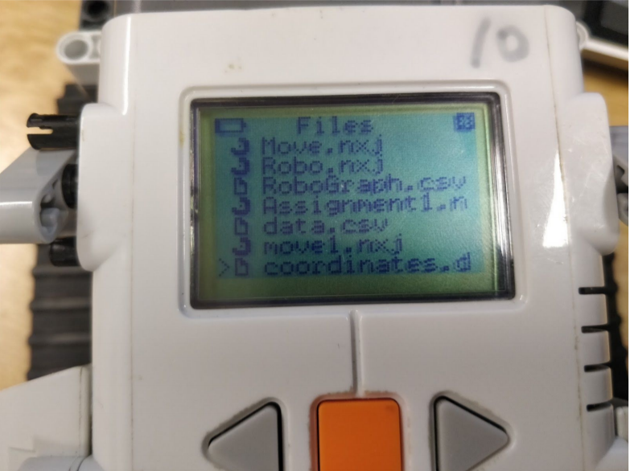
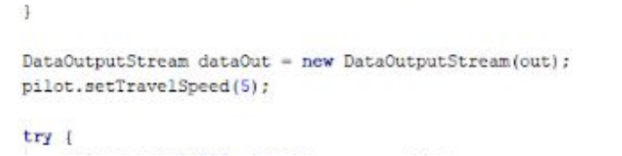
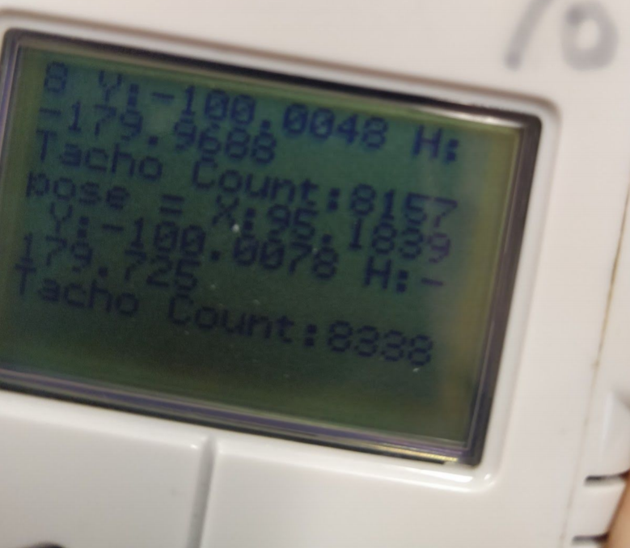

# Trajectory-Tracking-Robot
Using Lejos to program a robot to track its own position using Dead Reckoning localisation

## Sarmed Alwan

# Description of Differential Drive Robot

My robot was initially driven using 2 powered wheels and 1 unpowered
wheel, but I switched it to using 2 tracks on 4 wheels since I found this to
make it move more predictably. It was also much easier to calibrate its
track width and wheel diameter with this method. To calibrate these values,
I set them to my physical measurements of the robot in centimetres, and
then used trial and error to adjust them to values which made the robot
move as I required it to. I used a repeated print-out of getTachoCount() to
assist me in judging the movements of the robot and making sure they
were in accurate straight lines, since this was a more scientific method than
just using my eyes. For the 90 degree rotations, I was fortunate and simply
entering ‘pilot.rotate(-90);’ was sufficient for an accurate right-angled turn.
This wasn’t the case initially, when my track width and wheel diameter were
wrong, but once they were correct for the straight-line movement, they
worked well for the turns too. I also had a repeated read-out of the robot’s
position via ‘System.out.println("pose = " + opp.getPose());’, which helped
to judge that the robot was moving approximately in a 1-metre square path.

# Explanation of Software Code

At the start of the program, the following code is executed:

```
OdometryPoseProvider opp = new OdometryPoseProvider (pilot) ;
FileOutputStream out = null; // declare outside the try block
File data = new File("coordinates.dat");
try {
 out = new FileOutputStream(data);
} catch(IOException e) {
 System.err.println("Failed to create output stream");
}
DataOutputStream dataOut = new DataOutputStream(out);
```

This creates a provider for the location of the robot, and creates a file to
write the positions of the robot to.
Each time the robot moves along one of the edges, the following code is
executed repeatedly, a few times per edge:

```
while (pilot.isMoving()) {
 dataOut.writeChars(String.valueOf(opp.getPose()));
 System.out.println("pose = " + opp.getPose());
 System.out.println("Tacho Count:" + Motor.A.getTachoCount());
 Delay.msDelay(1000);
}
```

This writes the current position to the next line in the text file, and prints it to
the screen of the robot, along with the Tacho Count of Motor A, which helps
with debugging the movement of the robot and seeing how many cycles the
robot needs to travel 1 metre. Each time the loop finishes, there is a delay
of 1000ms, so these values are recorded a few times for each edge of the
square, i.e. for each of the 4 straight line movements of the robot.

# Evaluation of Robot






Above is the trajectory displayed in coordinates, with the Tacho Count also
showing the distance travelled by the robot. The coordinates are saved to a
file ‘coordinates,’ as can be seen below.



Below are also the results when I set the speed of the robot to 5, slowing it
down a lot.





As is apparent, the coordinates and Tacho Count are changing much more
slowly, as expected.

## Comments on Dead Reckoning Localisation

In this program it was not necessary for me to adjust the robot’s path as it
went along, as it was nearly a perfect square once calibrated correctly.
There was some error in the square, but this was largely fixed by making
the physical construction of the robot more stable; initially, there was a
small misalignment in the tracks caused by a loose connection, which
would grow larger as the robot travelled more. I replaced the part and the
robot’s path became at least half as inaccurate. Another factor in the
inaccuracies is tiny manufacturing variations in the motors, which are
unavoidable, and which cause the robot to have a slight unpredictable
margin to its movement. The floor is also not perfectly smooth and flat, and
the tracks have a bit of varying friction with the sides of the robot, where
they drag against it. Slowing down the robot’s travel speed helped to make
the trajectory a more accurate square, and slowing down the rotation speed
can help further. I could also possibly take slightly more accurate
measurements of the track width and wheel diameter, since they were
adjusted in increments via trial and error, though the values seem to be
approximately correct.

# Program Code

```
import lejos.nxt.*;
import lejos.nxt.Motor;
import lejos.robotics.navigation.DifferentialPilot;
import lejos.util.Delay;
import lejos.robotics.localization.OdometryPoseProvider ;
import java.io.*;
/**
* Created by sa16566 on 26/01/2018.
*/
public class move1 {
 public static void main(String[] args) {
 DifferentialPilot pilot = new DifferentialPilot(3.25, 20, Motor.A, Motor.C,
false); // parameters in inches
 OdometryPoseProvider opp = new OdometryPoseProvider (pilot) ;
 FileOutputStream out = null; // declare outside the try block
 File data = new File("coordinates.dat");
 try {
 out = new FileOutputStream(data);
 } catch(IOException e) {
 System.err.println("Failed to create output stream");
 }
 DataOutputStream dataOut = new DataOutputStream(out);
 pilot.setTravelSpeed(5);
 try {
 pilot.travel(100, true); // cm
 while (pilot.isMoving()) {
 dataOut.writeChars(String.valueOf(opp.getPose()));
 System.out.println("pose = " + opp.getPose());
 System.out.println("Tacho Count:" + Motor.A.getTachoCount());
 Delay.msDelay(1000);
 }
 //try { Thread.sleep(2000); }
 //catch ( InterruptedException e ) {}
 pilot.rotate(-90); // degrees clockwise
 pilot.travel(100, true); // cm
 while (pilot.isMoving()) {
 dataOut.writeChars(String.valueOf(opp.getPose()));
 System.out.println("Pose: " + opp.getPose());
 System.out.println("Tacho Count:" + Motor.A.getTachoCount());
 Delay.msDelay(1000);
 }
 //try { Thread.sleep(2000); }
 //catch ( InterruptedException e ) {}
 pilot.rotate(-90);
 pilot.travel(100, true); // cm
 while (pilot.isMoving()) {
 dataOut.writeChars(String.valueOf(opp.getPose()));
 System.out.println("pose = " + opp.getPose());
 System.out.println("Tacho Count:" + Motor.A.getTachoCount());
 Delay.msDelay(1000);
 }
 //try { Thread.sleep(2000); }
 //catch ( InterruptedException e ) {}
 pilot.rotate(-90); // degrees clockwise
 pilot.travel(100, true); // cm
 while (pilot.isMoving()) {
 dataOut.writeChars(String.valueOf(opp.getPose()));
 System.out.println("pose = " + opp.getPose());
 System.out.println("Tacho Count:" + Motor.A.getTachoCount());
 Delay.msDelay(1000);
 }
 //try { Thread.sleep(2000); }
 //catch ( InterruptedException e ) {}
 Delay.msDelay(20000);
 //try { Thread.sleep(20000); }
 //catch ( InterruptedException e ) {}
 pilot.stop();
 out.close();
 } catch (IOException e){
 System.out.println("IO Exception");
 }
 }
}
//public static class LCDDraw implements Runnable{
 // @Override
 //public void run(){
 // LCD.drawChar(".", -1*Math.round(x/10)*Math.round(y/12));
 // }
//}
//pilot.steer(-50, 180, true); // turn 180 degrees to the right
//pilot.steer(100); // turns with left wheel stationary
//while (pilot.isMoving()) Thread.yield();
```

